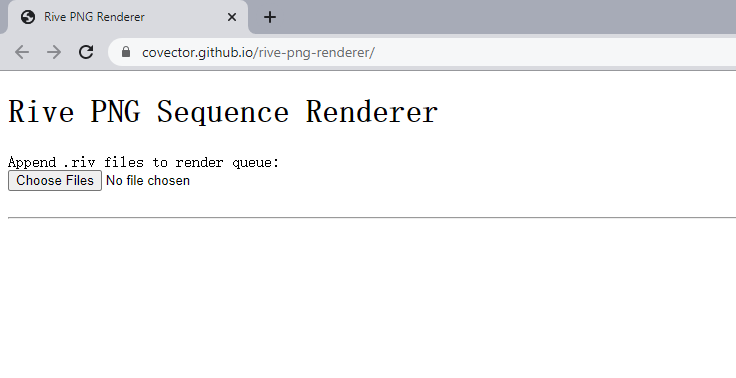
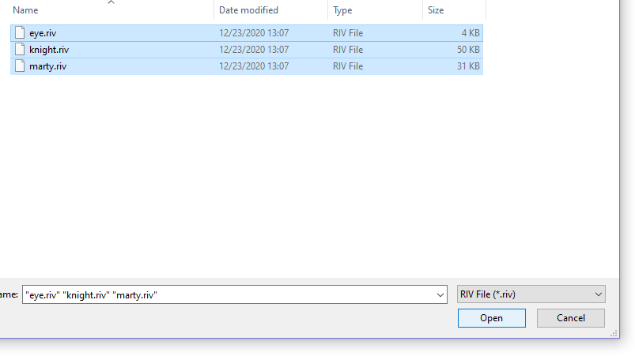
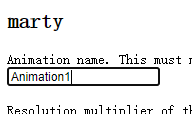
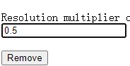
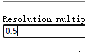
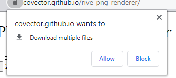
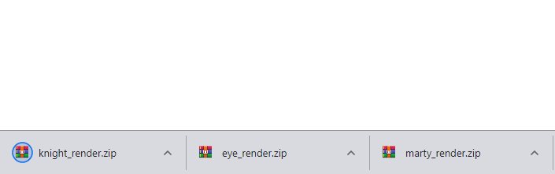

# Rive PNG Sequence Renderer
This is a temporary replacement for the Cloud Render feature, which allows you to export Rive animation as video.
## Steps to use
1. Go to the [webpage](https://covector.github.io/rive-png-renderer/)

2. Select one or more .riv files

3. Type the animation names. These must match the ones specified in the Rive animation mode timeline

4. Type the resolution multiplier E.g. if the original artboard is set to 800x800 and the resolution mutiplier is set to 2, the output resolution will be 1600x1600

5. Press the Render button

6. Download will start automatically after rendering. The browser may ask you whether you would allow multiple files download, this is because a zip file will be generated for each .riv file

## Dependencies
[Rive Runtime](https://github.com/rive-app/rive-wasm) 
[JSZip](https://github.com/Stuk/jszip) 
[FileSaver.js](https://github.com/eligrey/FileSaver.js)
