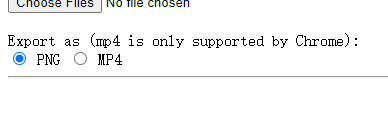

# Rive PNG Sequence Renderer
## ** MP4 Rendering is now supported. But it is a lot slower than PNG Rendering**
This is a website for rendering Rive animation as PNG Image Sequence and MP4. This can act as a temporary replacement for the Cloud Render feature, which allows you to export Rive animation as video.

## Steps to use
1. Go to the website: [https://covector.github.io/rive-png-renderer/](https://covector.github.io/rive-png-renderer/)

2. Select one or more .riv files

3. Select the format to export (mp4 is only supported by Chrome)

4. Type the animation names. This must match the ones specified in the Rive animation mode timeline

5. Type the resolution multiplier E.g. if the original artboard is set to 800x800 and the resolution mutiplier is set to 2, the output resolution will be 1600x1600

6. Type the frame per second for the output render E.g. if the original animation is set to 60fps in Rive and the fps here is set to 120, the output will have twice the number of frames while keeping the same duration

7. Press the Render button

8. Download will start automatically after rendering. The browser may ask you whether you would allow multiple files download, this is because a zip file will be generated for each .riv file

## Credit
Library used: 
[Rive Runtime](https://github.com/rive-app/rive-wasm) 
[JSZip](https://github.com/Stuk/jszip) 
[FileSaver.js](https://github.com/eligrey/FileSaver.js) 
[FFmpeg wasm](https://github.com/ffmpegwasm/ffmpeg.wasm)